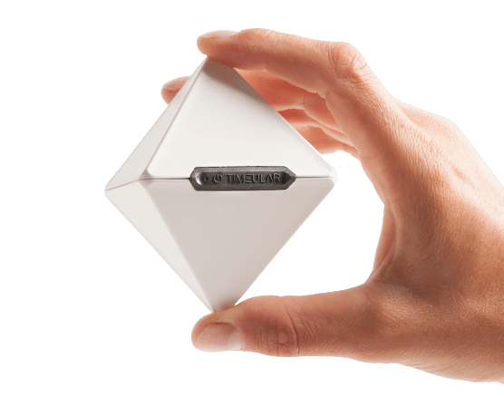
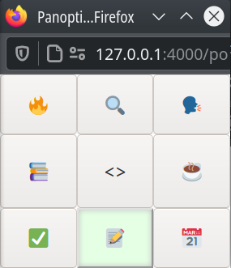

Panopticon
==========
Panopticon is a web application for tracking time spent programming at work.

Why
---
What do you even do all day?

I was on an experimental SRE (site reliability engineering) team at a previous
job, and my manager suggested that we use something [like this][1] to track
time:

The idea was to measure how much SRE time was spent doing operational work,
and adjust prioritizes to make sure it's less than 50% (the other 50% to be
spent developing tooling and automation).

We didn't buy any octohedra, but I wrote a little user interface tool that
we could pin to the corner of one of our screens and use to indicate our
"activity status," e.g. "in a meeting," or "coding," or "responding to an
issue." Then the intervals of activity could be dumped to a spreadsheet for
analysis.

Panopticon is an web-based non-proprietary descendent of that tool.

What
----
Panopticon is a pair of HTML pages served by a Python web server, backed by a
SQLite database.

It implements a web application that allows you to indicate what kind of thing
you're currently doing, and then later analyze how much of each kind of thing
you were doing over a period of time (e.g. last week).

The status indicator looks like this:

In this example, the "paperwork" status is selected.

How
---
TODO

[1]: https://timeular.com/
